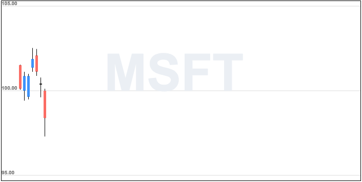

# Create candlestick charts using HTML Canvas

This open source package will seek to solve only one problem - creating static candlestick charts in an app from a source of data that will plot using HTML Canvas and a sprinkle of JavaScript.

At the moment, it will only serve daily candlestick charts for a 100 data points (aka 100 day chart, about 5 months worth of data.) If this project picks up, or if there is enough time available, I'd like to develop additional features.

If you would like to view a working sample or play around with the code, check it out here on Codepen*: [Live Preview](https://codepen.io/aizkhaj/pen/ZjvdrM). 
Otherwise here's a picture:


*Please note that the preview example only uses 7 data points as a test.

## Data Source

This tool is currently designed for the usage of [Alpha Vantage](https://www.alphavantage.co/) data which is currently available for free through their API. You may acquire data either in JSON or CSV. CSV data has not been tested on this tool yet, but if used with a CSV -> JSON tool, I'm sure it's possible to use it here as well.

Other forms of JSON data should work too, but will require some tweaking to the code that accesses the different key/values needed.

## Get Started

1. Install the npm package: `npm install candlestickcharts`

2. `require('candlestickcharts');` to where it's needed in your project.

## Options available

`canvas:` define your canvas tag here.

`padding:` how much padding you will need in your chart.

`gridScale:` What scale you want the Y axis to be increasing by.

`gridColor:` What color you want the grid lines to be.

`bullColor:` The color of a bullish/increasing candle.

`bearColor:` The color of a bearish/decreasing candle.

`data:` Point to your data source here.

## How to use Candlesticks.js in 5 Steps

```javascript
// 1. Store your HTML Canvas element into a variable.
let myCanvas = document.getElementById("stockChart");

// 2. Determine the size of your canvas. Below sizes are what's been tested for.
// Min. width can be 600. Anything smaller will be tougher to display information adequately for 100 data points.
myCanvas.width = 700;
myCanvas.height = 350;

// 3. Create an object with your specified options. Here's a sample object with the chart options in use:
const msftDaily = {
  canvas: myCanvas,
  padding: 10,
  gridScale: 5,
  gridColor: "#DBDBDB",
  bullColor: "#3D92FA",
  bearColor: "#FB6C64",
  data: json
};

// 4. Instantiate a new chart.
let myChart = new Candlesticks(msftDaily);

// 5. Draw your chart!
myChart.draw();
```